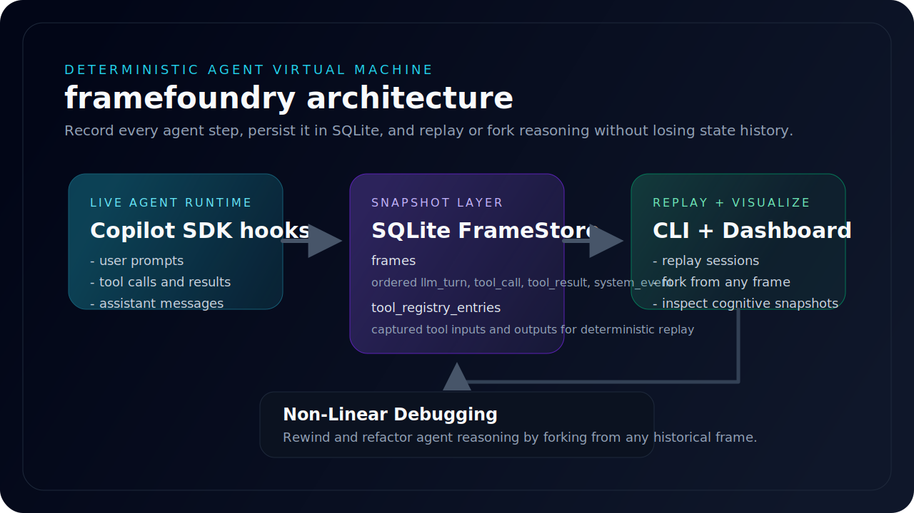
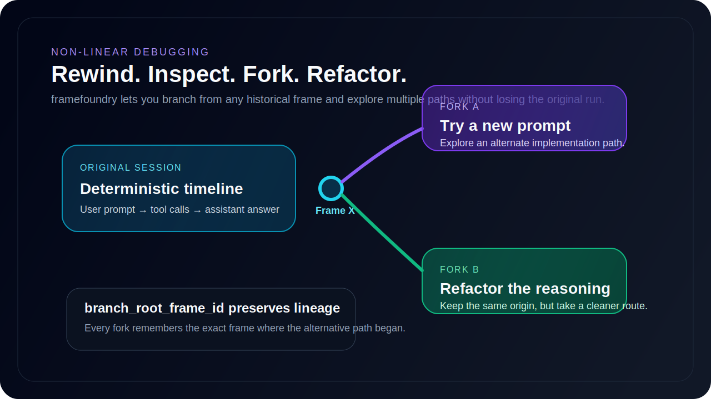
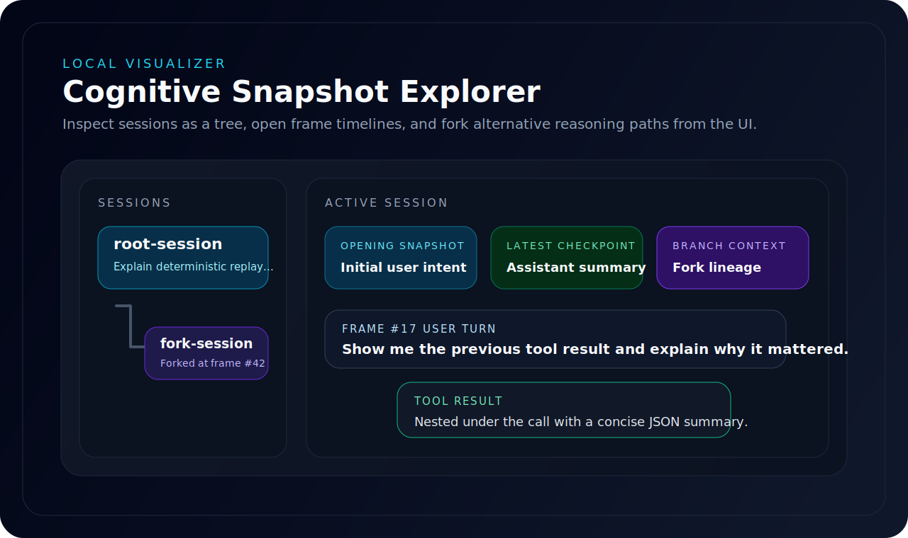

# framefoundry

**framefoundry** is a local-first **Deterministic Agent Virtual Machine (dAVM)** for recording, replaying, branching, and visualizing AI agent execution.

It captures every meaningful step of an agent session as a persistent SQLite timeline so you can:

- **record** agent turns and tool calls
- **replay** sessions deterministically from recorded tool outputs
- **fork** execution from an earlier frame and continue in a new direction
- **inspect** the full cognitive timeline in a local visualizer

<p align="center">
  
</p>

## Why framefoundry exists

Modern agent workflows are powerful, but they are hard to debug. Once a tool call has executed or a model response has streamed back, the exact execution path is often gone.

framefoundry treats agent execution like a navigable runtime:

- each LLM turn becomes a **Frame**
- each tool invocation becomes a **Frame**
- each tool result is stored for deterministic reuse
- each branch preserves its origin through **`branch_root_frame_id`**

The result is an environment where agent behavior can be replayed, inspected, and evolved instead of merely observed once.

## Core capabilities

### Recording

The runtime stores agent activity in SQLite using a `frames` table plus a tool registry:

- `llm_turn`
- `tool_call`
- `tool_result`
- `system_event`

Tool inputs and outputs are persisted so replay can short-circuit live execution.

### Deterministic replay

Recorded sessions can be replayed using the saved tool registry instead of making live tool calls. This allows the runtime to reconstruct prior execution using recorded data.

### Forking

framefoundry turns branching into **Non-Linear Debugging**: developers can **rewind and refactor** agent reasoning by forking from any historical frame.

Any selected frame can become a branch point. A fork clones the historical state up to the selected frame, tags the new branch with `branch_root_frame_id`, and then continues from there with a new prompt.

<p align="center">
  
</p>

### Local visualizer

The included React dashboard provides:

- session navigation
- nested branch navigation for forked sessions
- frame timeline inspection
- tool call / tool result grouping
- raw JSON inspection
- frame selection and forking from the UI

<p align="center">
  
</p>

## Architecture

### SQLite persistence

The SQLite layer is the foundation of the runtime.

- **`frames`** stores ordered session state
- **`tool_registry_entries`** stores replayable tool I/O

### Runtime services

- **`src/db.ts`** — typed SQLite persistence and frame registry
- **`src/agent.ts`** — Copilot SDK orchestration and recording hooks
- **`src/replay.ts`** — replay and fork execution logic
- **`src/server.ts`** — Express bridge for the visualizer
- **`src/index.ts`** — CLI entry point

### Frontend

- **`visualizer/`** — Vite + React + Tailwind visualizer

## Getting started

### Prerequisites

- Node.js 24+
- npm

### Install

```powershell
Set-Location 'C:\Users\Todd\dAVM'
npm install
npm --prefix visualizer install
```

### Build

```powershell
Set-Location 'C:\Users\Todd\dAVM'
npm run build
```

## Using framefoundry on a real project today

framefoundry can already be used against another project folder, but the current workflow is still **manual**.

The key idea is:

- **framefoundry repo** = the runtime, recorder, replay engine, and visualizer
- **your project folder** = the working directory the agent operates in

Today, the simplest way to use framefoundry on a real project is to launch the built CLI and server **from your project directory** while pointing to the compiled framefoundry files with an absolute path.

### What happens in a real-project run

When you do this correctly:

1. the agent runs with **your project folder** as its working directory
2. `davm.sqlite` is created in **your project folder**
3. the visualizer reads that project-specific SQLite file
4. forks and replays stay attached to that same project timeline

### Real-project quickstart

#### 1. Build framefoundry once

From the framefoundry repo:

```powershell
Set-Location 'C:\Users\Todd\dAVM'
npm install
npm --prefix visualizer install
npm run build
```

#### 2. Copy `schema.sql` into the target project root

From a new terminal, go to the project you actually want to work on and copy the schema file there:

```powershell
Set-Location 'C:\path\to\your-project'
Copy-Item 'C:\Users\Todd\dAVM\schema.sql' '.\schema.sql'
```

This is required in the current version because the runtime resolves `schema.sql` relative to the current working directory.

#### 3. Record a session from the target project root

Stay in your project folder and run the compiled framefoundry CLI by absolute path:

```powershell
Set-Location 'C:\path\to\your-project'
node 'C:\Users\Todd\dAVM\dist\index.js' record "Inspect this project and propose the next build step."
```

That run will:

- use your project folder as the working directory
- create `davm.sqlite` in your project root
- record the session into that project-local database

#### 4. Start the API bridge against the same project database

In another terminal, stay in the project root and start the server from there:

```powershell
Set-Location 'C:\path\to\your-project'
node 'C:\Users\Todd\dAVM\dist\server.js'
```

Because the server is started from the project root, it will read that project's `davm.sqlite`.

#### 5. Start the visualizer from the framefoundry repo

In a third terminal:

```powershell
Set-Location 'C:\Users\Todd\dAVM'
npm run visualizer:dev
```

Then open:

```text
http://localhost:5173
```

You should now see the sessions recorded for that project.

### Recommended terminal layout

For the current version, the cleanest setup is:

1. **Terminal A** — your project root, running `record`
2. **Terminal B** — your project root, running `server.js`
3. **Terminal C** — framefoundry repo, running `visualizer:dev`

### What is manual right now

framefoundry does **not** yet automatically attach itself to a normal GitHub Copilot chat window or every Copilot CLI session on your machine.

At the moment you must:

- launch the session through framefoundry's CLI
- keep a copy of `schema.sql` in the project root
- start the API bridge from the same project folder whose `davm.sqlite` you want to inspect

### Current limitations

- The default runtime assumes `schema.sql` is present in the current working directory.
- The visualizer only shows the database exposed by the currently running API bridge.
- Real-project onboarding is usable today, but it is not yet a one-command experience.

The next natural improvement is a dedicated `--project-path` or `--db-path` workflow so framefoundry can target any folder without the schema-copy step.

## CLI usage

The CLI entry point is `davm`.

### Record a session

```powershell
node dist\index.js record "Explain deterministic replay."
```

### Replay a session

```powershell
node dist\index.js replay <sessionId>
```

### Inspect a session log

```powershell
node dist\index.js log <sessionId>
```

## Running the visualizer

### Start the API bridge

```powershell
Set-Location 'C:\Users\Todd\dAVM'
npm run serve
```

### Start the frontend

In a second terminal:

```powershell
Set-Location 'C:\Users\Todd\dAVM'
npm run visualizer:dev
```

Then open:

```text
http://localhost:5173
```

## HTTP API

The Express bridge exposes:

### `GET /api/sessions`

Returns all known session IDs.

### `GET /api/sessions/:id`

Returns all frames for a session ordered by sequence.

### `POST /api/sessions/:id/replay`

Runs deterministic replay for a recorded session.

### `POST /api/sessions/:id/fork`

Forks execution from a selected frame.

Request body:

```json
{
  "frameId": 42,
  "newPrompt": "Take this in a different direction."
}
```

## Example workflow

1. Record a session with the CLI.
2. Open the visualizer and inspect the timeline.
3. Select a frame.
4. Click **Fork from here**.
5. Continue the session with a new prompt.

## Repository layout

```text
src/
  agent.ts
  db.ts
  index.ts
  replay.ts
  server.ts
visualizer/
  src/
schema.sql
```

## Status

framefoundry already includes the core dAVM loop:

- recording
- deterministic replay
- branching / forking
- local visualization

The next natural layer is deeper state navigation, richer frame filtering, and more advanced replay controls.
